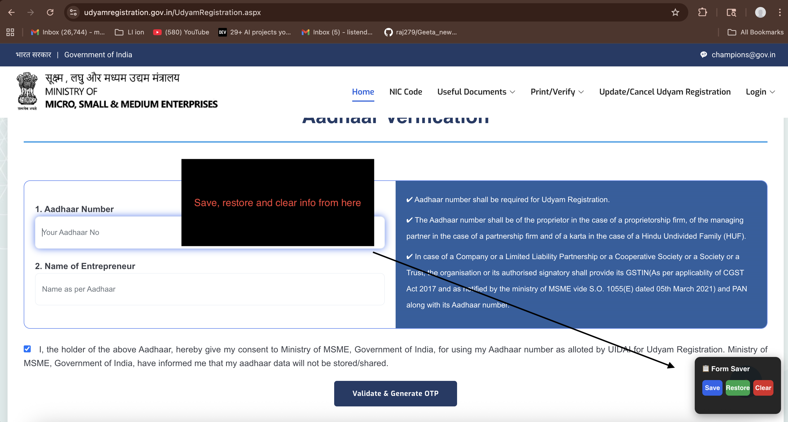

# Udyam Form Saver

Tired of filling in the same details over and over on the Udyam Registration website?

This tool adds **Save**, **Restore**, and **Clear** buttons directly on the Udyam registration page. Fill the form once, hit Save — and next time just hit Restore.



---

## Step 1 — Install Tampermonkey

Tampermonkey is a free browser extension that lets you run small scripts on websites.

1. Open Google Chrome
2. Go to the [Tampermonkey page on Chrome Web Store](https://chrome.google.com/webstore/detail/tampermonkey/dhdgffkkebhmkfjojejmpbldmpobfkfo)
3. Click **"Add to Chrome"** → click **"Add extension"** when prompted
4. You'll see the Tampermonkey icon (a dark circle with two dots) appear in your Chrome toolbar

---

## Step 2 — Enable "Allow User Scripts" in Chrome

> **Important:** Chrome requires this one-time setting for Tampermonkey scripts to work.

1. In Chrome, go to this address in your browser bar: `chrome://extensions`
2. Find **Tampermonkey** in the list and click **"Details"**
3. Scroll down and turn on **"Allow user scripts"**
4. Close the tab

---

## Step 3 — Install This Script

1. Click the Tampermonkey icon in your Chrome toolbar
2. Click **"Create a new script"**
3. A code editor will open with some placeholder text — **select all of it** (`Ctrl+A`) and **delete it**
4. Open the file `udyam_form_saver.user.js` (from this folder) in Notepad or any text editor
5. Select all the text (`Ctrl+A`), copy it (`Ctrl+C`)
6. Go back to the Tampermonkey tab and paste it (`Ctrl+V`)
7. Press **`Ctrl+S`** to save

---

## Step 4 — Use It

1. Go to the [Udyam Registration website](https://www.udyamregistration.gov.in/UdyamRegistration.aspx)
2. You will see a small **"Form Saver"** box in the **bottom-right corner** of the page
3. Fill in your details as usual
4. Click **Save** — your details are saved
5. If the page refreshes or you come back later, click **Restore** — all your details will be filled back in automatically

---

## The Three Buttons

| Button | What it does |
|--------|--------------|
| 💾 **Save** | Saves everything you've filled in so far |
| ♻️ **Restore** | Fills the form back with your saved details |
| 🗑️ **Clear** | Deletes the saved details (start fresh) |

---

## After You Submit the Form

> **Please clear your data once you're done.**

Your saved details include sensitive information like your **Aadhaar number** and personal details. Once you have successfully submitted the form:

1. Go back to the Udyam Registration page
2. Click the **Clear** button in the Form Saver panel
3. Your data will be permanently deleted from the browser

This is a good habit — don't leave sensitive government data sitting in your browser longer than needed.

---

## Where is my data stored?

Your data stays **only on your computer** — it is never uploaded or shared anywhere.

Technically, it is stored inside Tampermonkey's private extension storage in Chrome. You can view or delete it manually at any time:

> Tampermonkey icon → Dashboard → click **"Udyam Form Saver"** → go to the **Storage** tab

The raw storage location on your Mac (binary, not human-readable):
```
~/Library/Application Support/Google/Chrome/Default/Local Extension Settings/dhdgffkkebhmkfjojejmpbldmpobfkfo/
```

---

## Common Questions

**Will my data be sent anywhere?**
No. Everything stays on your computer inside the Tampermonkey extension. Nothing is uploaded or shared.

**What if I don't see the Save/Restore/Clear box on the page?**
Make sure you're on this exact URL: `https://www.udyamregistration.gov.in/UdyamRegistration.aspx`
Also check that the Tampermonkey icon shows a **"1"** badge — that means the script is active on the page.

**Does it work after I restart my computer?**
Yes. Your saved details stay until you click Clear.

**Does it work on other websites?**
No, this script only runs on the Udyam Registration website.

---

## License

MIT — free to use and share.
